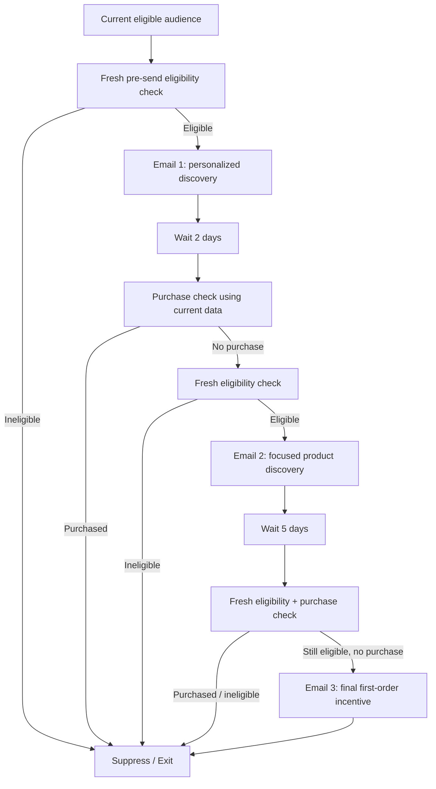
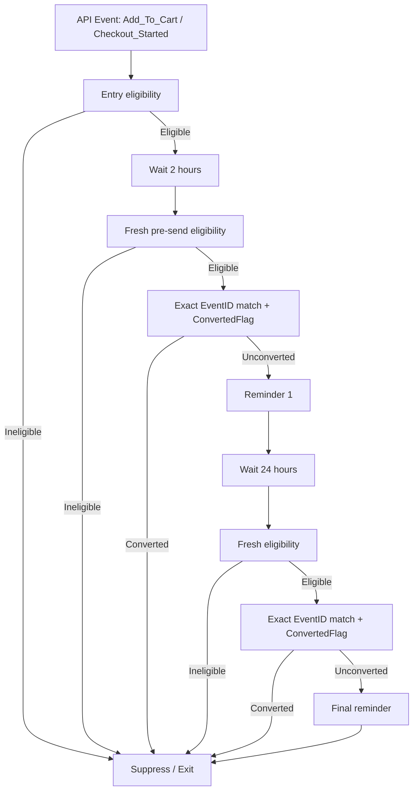

# Salesforce Marketing Cloud D2C Lifecycle Automation

A self-initiated, simulated Salesforce Marketing Cloud portfolio project for a fictional D2C personal-care brand.

The project demonstrates lifecycle journey design, Data Extension architecture, SQL audience segmentation, AMPscript personalization, Journey Builder decision logic, REST API/Postman integration design, consent/frequency governance, conversion attribution, QA thinking and KPI design.

> **Implementation boundary:** This is a portfolio simulation, not a production SFMC deployment. The REST integration is configured as a reference Postman collection with placeholder tenant credentials. No live SFMC API event, Journey Builder execution, Content Builder send, or customer email delivery is claimed.

## Business problem

The fictional brand wants to improve two lifecycle moments:

1. Convert opted-in prospects who have not yet made a first purchase.
2. Recover high-intent customers who add to cart or begin checkout but do not convert.

The design must avoid irrelevant follow-up after conversion, respect consent and frequency controls, and preserve event-level context for abandonment recovery.

## Solution overview

### Journey 1: First-Purchase Nurture



### Journey 2: High-Intent Abandonment



## Technical components

- **Data model:** customer, behavioral event, purchase, journey-entry, event-status and governance structures.
- **Journey 1 SQL:** creates a current first-purchase audience from opted-in, zero-order prospects below the communication cap.
- **Journey 2 entry:** modeled as a Journey Builder API Event using server-to-server OAuth.
- **Personalization:** AMPscript-style initialization and fallbacks for name, category, product and cart context.
- **Conversion attribution:** requires matching customer + nonblank CartID + valid timestamps + COMPLETED order state.
- **Governance:** fresh pre-send checks, layered consent concept, rolling-window send ledger design, cross-journey reservation design and fail-closed status handling.
- **Measurement:** distinguishes observed attribution from causal incrementality.

## Validation

The portfolio deliberately separates evidence levels:

- source-data checks
- formula/logic simulations
- manual timestamped walkthroughs
- design examples
- native SFMC UAT pending

The current project does **not** treat spreadsheet simulation as proof of native Journey Builder, AMPscript or API execution.

## Repository structure

```text
sfmc-d2c-lifecycle-automation/
├── README.md
├── sql/
├── ampscript/
├── api/
├── data/
├── qa/
└── docs/
```

## What remains tenant-dependent

A real SFMC tenant is still required to prove:

- native Data Extension configuration and constraints
- Journey Builder entry, wait, re-entry and exit behavior
- positive and negative REST API responses
- Content Builder AMPscript rendering and test sends
- All Subscribers / publication-list behavior
- delivered-message tracking and SFMC data-view reporting

See `docs/VALIDATION_BOUNDARIES.md` for the exact boundary.
